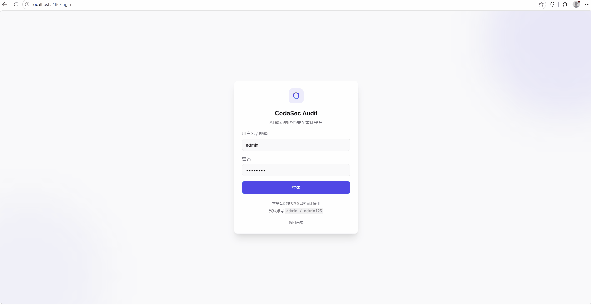

# .NET Code Security Audit Platform

> Upgrade an existing collection of 38 .NET audit Skills from a single-user CLI tool to a team-level web platform.
> Built on [`@openai/agents`](https://www.npmjs.com/package/@openai/agents) and fully self-hosted — no Copilot CLI / IDE plugin dependency.

<p align="left">
  <a href="#-quick-start"></a>
  <a href="#-testing--quality-gates"></a>
  <a href="#-testing--quality-gates"></a>
  <a href="#-testing--quality-gates"></a>
  <a href=".github/workflows/ci.yml"></a>
  <a href="#-license"></a>
</p>

[中文版](./README.md)

---

## 🏗️ What is this

The `.NET Code Security Audit Platform` is a **self-hosted, white-box code audit web platform**. A user uploads a `.NET` source archive through the browser; the backend loads 38 audit Skills from the local `./dotnet-security-audit-skill/` (upstream open-source .NET audit Skill collection, cloned from [`ZMR0zhangmouren/dotnet-security-audit-skill`](https://github.com/ZMR0zhangmouren/dotnet-security-audit-skill)) (6 infrastructure + 9 framework + 31 vuln + 9 shared specs) through the OpenAI Agents SDK and produces a triage-ready, assignable, traceable Vulnerability Library plus a Markdown report, following a "divide-then-merge" two-phase strategy.

- **🎯 Goal** —— make the submodule's existing audit orchestrator *collaborative, persistent, and auditable* — not re-implement orchestration (Q17 hard constraint)
- **🚫 Non-goals** —— never replace or modify `./dotnet-security-audit-skill/` (upstream open-source project maintained at [`ZMR0zhangmouren/dotnet-security-audit-skill`](https://github.com/ZMR0zhangmouren/dotnet-security-audit-skill); platform pins it via `SkillBundleVersion`); never let the Agent modify source; never decouple from `@openai/agents` (Q14 lock)

## ✨ Core Features

| # | Capability | Notes |
|---|-----------|-------|
| 1 | **Multi-source ingestion** | `zip` upload / `from-git` (HTTPS + SSH + 8 error categories) / `from-github` (REST tarball + credential priority env > git_credentials) |
| 2 | **Real concurrent scans** | BullMQ + Redis, default concurrency 2 (configurable 1–10), crash-recoverable, visualized via Bull-Board |
| 3 | **Library + instance, two-tier** | `VulnLibraryEntry` aggregates root cause; `Vulnerability` records instances; cross-ScanRun dedupe |
| 4 | **Multi-ScanRun diff** | `GET /api/projects/:id/scans/diff?a=&b=` returns full `ScanDiff` |
| 5 | **Real JWT + role guard** | `JwtStrategy` + `JwtAuthGuard` + `RolesGuard` + `@Roles('admin')` blocks write endpoints |
| 6 | **Multi Skill Bundle coexistence** | `setDefault` transactional atomicity; `replay-with-latest` re-runs an old ScanRun with the latest bundle |
| 7 | **Markdown report rendering** | `react-markdown` + `remark-gfm` + `rehype-highlight` + section navigator |
| 8 | **Agent Trace end-to-end tracking** | `agent_traces` table + `/api/scan-runs/:id/trace` + Timeline page |
| 9 | **Coverage gate** | `@vitest/coverage-v8` + shared/web 100% / api 80.18% thresholds enforced |
| 10 | **Docker deployment** | `apps/api` + `apps/web` multi-stage builds + `docker-compose.yml` 3-service stack |

## 🚀 Quick Start

> **Prereqs**: Node.js ≥ 20 LTS · pnpm 10 · (optional) Docker Desktop for Redis

```powershell
# 1. Install dependencies
pnpm install

# 2. Start Redis (needed by the scan queue)
docker run -d -p 6379:6379 --name audit-redis redis:7-alpine

# 3. Seed the default admin account (admin / admin123)
pnpm --filter @platform/api seed

# 4. Launch API (3030) + Web (5180) together
pnpm dev
```

Open <http://127.0.0.1:5180> in your browser → log in with `admin` / `admin123` → create a project → upload a `.NET` source archive → watch live scan logs, stage artifacts, and the final report on the `ScanRun` detail page.

> On Windows, you can also double-click `start.bat` / `stop.bat` / `status.bat` in the repo root.

## 📸 Key Screenshots

<p align="center">
  
  <br>
  <sup>Login → Dashboard → Project Detail → Scan → Report — full workflow with Indigo theme + Glassmorphism + Light/Dark toggle</sup>
</p>

> Full design spec: [`docs/superpowers/specs/2026-07-02-frontend-redesign-design.md`](./docs/superpowers/specs/2026-07-02-frontend-redesign-design.md)

## 🧱 Tech Stack

| Layer | Choice |
|-------|--------|
| AI orchestration | `@openai/agents` (OpenAI Agents SDK, TS/JS) + `openai` SDK |
| Backend | NestJS 10 + TypeScript 5.7 + Drizzle ORM |
| Frontend | React 18 + Vite 5.4 + shadcn/ui + Tailwind CSS 3 |
| Database | SQLite 3.x (MVP, 17 tables) + Drizzle migrations |
| Job queue | BullMQ + Redis (scan concurrency / crash recovery) + Bull-Board |
| Auth | `@nestjs/jwt` + `passport-jwt` + argon2id hashing |
| Testing | Vitest 2 + `@vitest/coverage-v8` (shared / api / web three projects) |
| Lint | ESLint 9 (flat config) + Prettier 3 |
| Package manager | pnpm 10 (workspace) |
| Deployment | Local `pnpm dev` / `start.bat` · Docker multi-stage builds (`docker-compose.yml`) |

## 📂 Repository Layout

```
.
├── apps/
│   ├── api/                          # @platform/api —— NestJS · 21 modules
│   │   └── src/
│   │       ├── admin/                #   admin subtree: queue-board (Bull-Board)
│   │       ├── agents/               #   @openai/agents loader + PoC
│   │       ├── agent-traces/         #   ★ Phase 3 end-to-end trace
│   │       ├── auth/                 #   JWT + argon2id + change-password
│   │       ├── code-versions/        #   zip upload + SHA-256 + LOC + from-git
│   │       ├── git-clone/            #   §5.7 real git clone (8 error categories)
│   │       ├── scan/                 #   ScanModule + Runner + BullMQ worker
│   │       ├── skills/               #   ★ Submodule Skill vendor executor
│   │       ├── report/               #   Markdown / JSON / zip report
│   │       ├── vulns/                #   VulnLibrary + Vulnerability two-tier
│   │       ├── projects/             #   CRUD + Members
│   │       ├── users/                #   user management
│   │       ├── settings/             #   AI Key (AES-256-GCM) + credentials + proxy
│   │       ├── skill-bundles/        #   multi-bundle coexistence + setDefault
│   │       ├── realtime/             #   WebSocket Gateway
│   │       ├── health/               #   /api/health + queue status
│   │       └── db/                   #   Drizzle schema (17 tables) + migrations
│   └── web/                          # @platform/web —— React + Vite (ESM)
│       └── src/pages/                #   17 pages + 3-zone layout (TopBar/Sidebar/Content) + responsive (Desktop/Tablet/Mobile)
├── packages/
│   └── shared/                       # @platform/shared —— cross-package enums and types
├── dotnet-security-audit-skill/      # ★ Upstream open-source .NET audit Skill collection (cloned from github.com/ZMR0zhangmouren/); platform pins via SkillBundleVersion, never modifies
│   ├── agents/dotnet代码审计.agent.md   #   Main Agent prompt
│   ├── skills/dotnet-audit-pipeline/   #   ★ Overall orchestration methodology
│   ├── skills/{route-mapper,auth-audit,vuln-scanner,...}/
│   └── shared/*.md                    #   9 shared specs
├── docs/                              # Deployment / ops docs (DOCKER.md ...)
├── start.bat / stop.bat / status.bat  # Windows shortcut scripts
├── docker-compose.yml                 # ★ 3 services (api / web / redis)
├── eslint.config.js · .prettierrc.json · vitest.config.ts
├── pnpm-workspace.yaml · tsconfig.base.json
├── 需求文档.md                          #   1,418-line product/tech spec (Q1–Q17 locks)
└── CLAUDE.md                          #   Project-level work conventions for AI assistants
```

## 🔁 Platform Architecture (ASCII)

```
                       ┌─────────────────────────────────────┐
                       │  Browser  (React + Vite + shadcn/ui) │
                       │  127.0.0.1:5180                      │
                       └────────────────┬────────────────────┘
                                            │  /api  /socket.io
                                            ▼
┌──────────────────────────────────────────────────────────────────────────┐
│  apps/api  (NestJS 10 · 127.0.0.1:3030)                                  │
│  ┌────────────┐  ┌────────────┐  ┌─────────────┐  ┌──────────────────┐  │
│  │ AuthGuard  │→ │ Controllers│→ │  Services   │→ │ Drizzle / SQLite │  │
│  │ JwtStrategy│  │ (16 mods)  │  │ (21 mods)   │  │   17 tables      │  │
│  └────────────┘  └────────────┘  └──────┬──────┘  └──────────────────┘  │
│                                          │                               │
│                                          ▼                               │
│                              ┌──────────────────────┐                    │
│                              │ BullMQ Queue (Redis) │                    │
│                              │ ScanQueue / Process  │                    │
│                              └──────────┬───────────┘                    │
│                                         │                                │
│                                         ▼                                │
│                        ┌─────────────────────────────────┐                │
│                        │ ScanRunnerService               │                │
│                        │  ├─ kickoff → 4 skills          │                │
│                        │  ├─ invokeSkill (vendor)        │                │
│                        │  └─ AgentTracesService.record   │                │
│                        └──────────┬──────────────────────┘                │
│                                   │ load instructions                      │
│                                   ▼                                        │
│  ┌─────────────────────────────────────────────────────────────────────┐  │
│  │  ./dotnet-security-audit-skill/  (upstream open-source Skill)        │  │
│  │   GitHub: ZMR0zhangmouren/dotnet-security-audit-skill                │  │
│  │   agents/dotnet代码审计.agent.md   ←── Main Agent                    │  │
│  │   skills/dotnet-audit-pipeline/SKILL.md ←── Overall methodology     │  │
│  │   skills/{route-mapper,framework×9,vuln×31,exploit-chain}/SKILL.md   │  │
│  │   shared/*.md (9 shared specs)                                       │  │
│  └─────────────────────────────────────────────────────────────────────┘  │
└──────────────────────────────────────────────────────────────────────────┘
                                            │
                                            ▼
                            ┌──────────────────────────────┐
                            │ Redis  (docker, 127.0.0.1:6379)│
                            └──────────────────────────────┘
```

## 🎯 Core Modules

| Module | Route prefix | Responsibility |
|--------|--------------|----------------|
| `auth` | `/api/auth/*` | Login (JWT 15 min), change-password, `/me`, password strength check |
| `projects` | `/api/projects/*` | Project CRUD, Members grant/revoke/role |
| `code-versions` | `/api/code-versions/*` | zip upload, SHA-256, LOC, `from-git`, `from-github` |
| `scan` | `/api/scan-runs/*` | Start / progress / cancel / replay / diff / coverage stats |
| `vulns` | `/api/projects/:id/vuln-library/*` | Library aggregation + detail + trend chart |
| `report` | `/api/projects/:id/scans/:runId/report` | Markdown / JSON / zip export |
| `agent-traces` | `/api/scan-runs/:id/trace*` | Full trace / summary / single entry |
| `skill-bundles` | `/api/skill-bundle-versions/*` | Read-only + `setDefault` / `publish` |
| `settings` | `/api/settings/*` | AI Key (AES-256-GCM), Git Credentials, Proxy |
| `users` | `/api/users/*` | User CRUD (admin only) |
| `realtime` | `/socket.io` | Scan log / progress WebSocket |
| `admin/queue-board` | `/admin/queue` | Bull-Board visualization (JWT admin OR Basic) |

## ⚙️ Common Commands

```powershell
# Whole stack
pnpm install              # install deps
pnpm -r typecheck         # tsc --noEmit for the three packages
pnpm -r test              # run Vitest per package (api 405 / shared 6 / web 59)
pnpm -r test --coverage   # generate v8 coverage report
pnpm lint                 # ESLint + Prettier --check
pnpm format               # Prettier --write
pnpm -r build             # build api + web + shared

# Single-package dev
pnpm --filter @platform/api dev      # nest start --watch
pnpm --filter @platform/web dev      # vite
pnpm --filter @platform/api seed     # create default admin account

# Docker
docker compose up -d --build         # spin up 3 services (api / web / redis)
```

## 🧪 Testing & Quality Gates

| Item | Status | Value |
|------|--------|-------|
| Total tests | ✅ | **464 passed** (shared 6 · api 405 · web 59), 0 failed, 0 warnings |
| Coverage | ✅ | shared / web **100%** + api **80.18%**, thresholds enforced and passing |
| TypeScript | ✅ | `pnpm -r typecheck` all three packages green |
| Lint | ✅ | ESLint **0 errors 0 warnings** + Prettier clean |
| CI | ✅ | `.github/workflows/ci.yml` 8 steps: `checkout → setup-node → pnpm cache → install (--frozen-lockfile) → typecheck → test → lint → coverage artifact` |

## 🐳 Docker Deployment

```bash
docker compose up -d --build
```

Three containers:

- `api` —— `apps/api` multi-stage build (node:20-alpine + musl better-sqlite3 compilation)
- `web` —— `apps/web` multi-stage build (node:20-alpine build → nginx:1.27-alpine serve)
- `redis` —— `redis:7-alpine`, used by BullMQ

On startup, the `api` container's `docker-entrypoint.sh` automatically runs Drizzle migrations and seeds the admin account.

See [`docs/DOCKER.md`](./docs/DOCKER.md).

## 🗺️ Roadmap

### ✅ Shipped (current repo state)

- ✅ Multi Skill Bundle coexistence + `replay-with-latest` (§11 Q7)
- ✅ Real `from-git` (HTTPS token + SSH key + 8 error categories)
- ✅ Real `from-github` (REST tarball + credential priority env > git_credentials)
- ✅ BullMQ + Redis + Bull-Board visualization
- ✅ Real JWT decode + AdminGuard + `@Roles('admin')` blocks write endpoints
- ✅ Agent Trace end-to-end tracking (`agent_traces` table + endpoints + Timeline page)
- ✅ Multi-ScanRun diff + Markdown report rendering + section navigator
- ✅ Vitest coverage v8 provider + enforced threshold gate
- ✅ Phase 4 Docker deployment (multi-stage + compose)
- ✅ Refresh-token + HttpOnly Cookie + rotation/revocation
- ✅ Phase 3 vulnerability trend chart (VulnLibrary aggregated by time)

### 📋 Backlog candidates

- Phase 2 e2e: cover 12 web pages with React Testing Library
- Real git clone e2e: verify against a public repo with real credentials
- Skill upgrade auto re-scan (CI hook)
- Remote backup: `git push` after the user provides a git remote URL

Full history is in [`CLAUDE.md`](./CLAUDE.md) and [`需求文档.md`](./需求文档.md).

## 📜 License

Internal — not open source at this time. All commits stay on the local `main` branch (see [`CLAUDE.md`](./CLAUDE.md) "local-only, no remote push").

---

<sub>Built with assistance from Claude Code · 2026-07-02 (UI redesign)</sub>